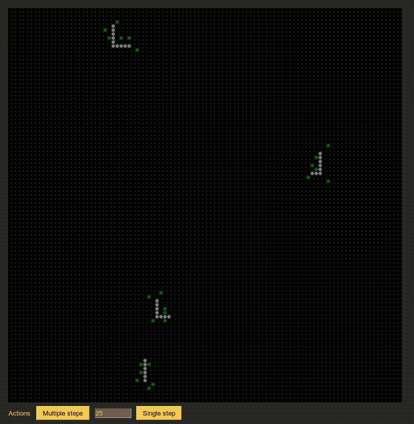

# Simulate a city
Welcome to the repository of group 8

## Project
The model we build is a simulation of a city based on a GIS-system called DUEM[1]. How the city grows depends on multiple parameters and rules.

### GIS
This acronym stands for geographic information system and is used for gathering and analyzing large amounts of geographical data.  It analyzes spatial location and organizes layers of information into visualizations by using maps or 3d models of landscapes.

### DUEM[2]
Cellular automata can be used to represent spatial and temporal dynamics. The key feature of cellular automata are  as the name implies, the capacity or splitting up a spatial field into cells, allowing for models of emergent behavior based on simple cell-based rules. DUEM is the result of implementing cellular automata mechanics into a GIS framework.

## Basic components

### Nodes
Nodes create other nodes. They also form the backbone of the street network which starts from the iniating node. The process of the initiating node finding the next node to build out the street network is known as percolation

### Streets
Streets are the edges between nodes and they only form when the proportions of surrounding activities within its neighbourhood are within certain treshold.
Activities

### Activities
We make use of three different activities and streets.
We have houses, which generate other houses, industry and even stores.
We have industry, which can only spawn industry and stores which can only spawn stores.
Streets can only be build when there is a specific threshold of activity in the neighbourhood, and houses and industry can only be build when streets are present.
This way, the development of the city follows the development of the streets and the other way around.

## Parameters
Our model makes use of multiple parameters. Considering there are several restrictions, the parameters need to be tuned in order to get a fully developed, heterogenous city.

## Papers
[1] https://www.ucl.ac.uk/bartlett/casa/sites/bartlett/files/ceus-paper.pdf 

[2] https://onlinelibrary.wiley.com/doi/abs/10.1111/j.1538-4632.1996.tb00940.x

## Simulation

We see that it contains streets (grey), houses (green), industry (yellow) and stores (blue).

## Running the code
A visualisation of a single run of the experiment can be done by running *gui.py*. This one runs with standard paramaters
*multiple_runs.py* runs and saves several experiments.
For changing the parameters, go to *city_model.py* and change them in the corresponding thresholds.
The *cluster_plots.py* generates six plots of the done experiments considering sizes of the clusters.
For this the data folder needs to be present.

### Contributors
Bart van Laatum

Roel van der Burght

Sami Achetib

Wiebe Jelsma
